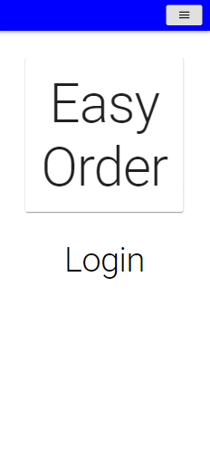
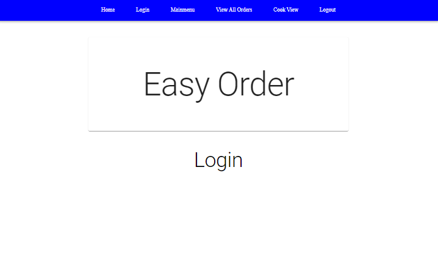

#  Easy Order

This is a point of sale MERN application for a small restaurant.  It handles order taking, order views and order payment.

 
 

## Table of Contents

* [Installation](#Installation)
* [Usage](#Usage)
* [License](#License)
* [Contributing](#Contributing)
* [Tests](#Tests)
* [Questions](#Questions)

 
 

## Installation

This application is deployed to https://easyorder3.herokuapp.com/ but the repo can also be downloaded and customized from GitHub.

 
 

## Usage

Browse to the web address and use the demo credentials to explore the application.

 
 

## Screenshot Mobile

 
 

## Screenshot Desktop

 
 

## License

[GNU GPLv3](https://choosealicense.com/licenses/gpl-3.0/)

 
 

## Contributing

Please fork the repo, email me, or open an issue in GitHub.

 
 

## Tests

Run the 'npm run test' for running the availible tests.

 
 

## Questions  

If you have questions about the project you can email me, or you can open an issue in the GitHub repository.

My GitHub profile is: [BenjDG](https://github.com/BenjDG)  
  
Email: bdgalloway85@gmail.com.  
